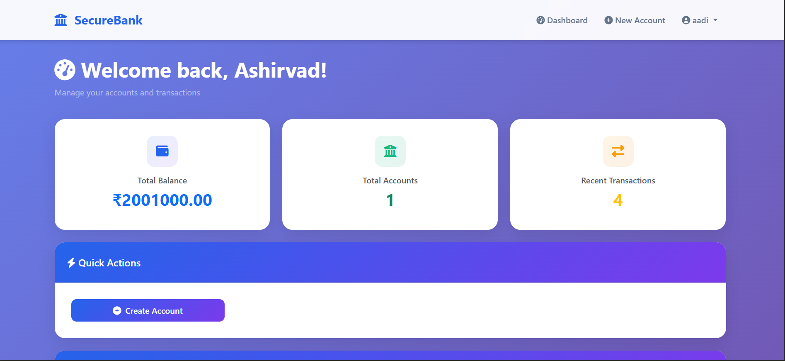
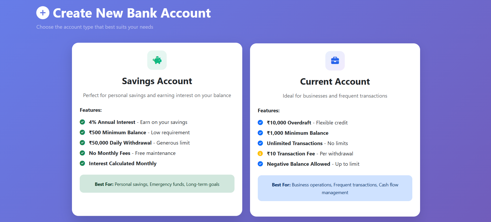
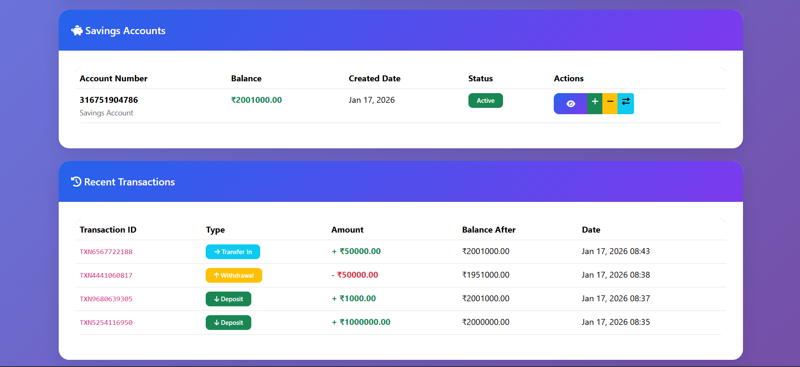
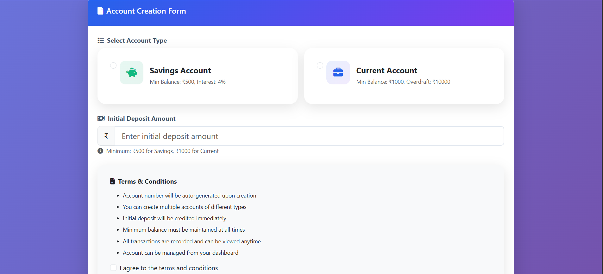

# 🏦 SecureBank - Online Banking System
SecureBank is a complete online banking platform that allows users to register, create multiple bank accounts (Savings/Current), perform secure transactions, and track their financial activities. Built using Django and OOP principles, it demonstrates real-world application development with production-ready deployment on Render cloud platform.


[Live Demo](https://banking-system-2-b8n6.onrender.com) 
## 🌐 Live Demo

### **[👉 Click Here to View Live Application](https://banking-system-2-b8n6.onrender.com)**

**Demo Credentials:**

| Role | Username | Password |
|------|----------|----------|
| Admin | `admin` | `admin123` |
| User | `demo_user` | `demo123` |

> **Note**: Feel free to create your own account and test all features!

---


<div align="center">


**A complete, production-ready banking system built with Django demonstrating Object-Oriented Programming principles.**

• [Documentation](#documentation) • [Report Bug](https://github.com//banking-system/issues) • [Request Feature](https://github.com/ASHIRVAD-MISHRA/banking-system/issues)

</div>

---


## ✨ Features

<table>
  <tr>
    <td>🔐 <b>Secure Authentication</b></td>
    <td>User registration and login with password hashing</td>
  </tr>
  <tr>
    <td>💳 <b>Multiple Account Types</b></td>
    <td>Savings (4% interest) and Current (overdraft) accounts</td>
  </tr>
  <tr>
    <td>💰 <b>Banking Operations</b></td>
    <td>Deposit, Withdraw, and Transfer money instantly</td>
  </tr>
  <tr>
    <td>📊 <b>Transaction History</b></td>
    <td>Complete audit trail with filters and export to CSV</td>
  </tr>
  <tr>
    <td>📱 <b>Responsive Design</b></td>
    <td>Mobile-friendly interface that works on all devices</td>
  </tr>
  <tr>
    <td>👨‍💼 <b>Admin Dashboard</b></td>
    <td>Comprehensive management panel for administrators</td>
  </tr>
  <tr>
    <td>🎨 <b>Modern UI/UX</b></td>
    <td>Beautiful gradient design with smooth animations</td>
  </tr>
  <tr>
    <td>🔒 <b>Bank-Level Security</b></td>
    <td>CSRF protection, SQL injection prevention, XSS protection</td>
  </tr>
</table>

---

## 📸 Screenshots

<details>
<summary>Click to view screenshots</summary>

### Landing Page


### User Dashboard


### Account Creation


### Transactions


### Transaction History


</details>

---

## 🚀 Quick Start

### Prerequisites

- Python 3.8 or higher
- pip (Python package manager)
- Git


## 🏗️ Tech Stack

### Backend
- **Django 5.0** - Python web framework
- **Python 3.11** - Programming language
- **SQLite** - Database (development)
- **PostgreSQL** - Database (production)

### Frontend
- **Bootstrap 5.3** - CSS framework
- **HTML5** - Markup
- **CSS3** - Styling
- **JavaScript** - Interactivity
- **Font Awesome 6** - Icons

### Deployment
- **Render** - Hosting platform
- **Gunicorn** - WSGI HTTP Server
- **WhiteNoise** - Static file serving

---

## 🧠 OOP Concepts Demonstrated

This project demonstrates all four pillars of Object-Oriented Programming:

### 1️⃣ Encapsulation
```python
class Account(models.Model):
    # Private attribute
    balance = models.DecimalField(max_digits=12, decimal_places=2)
    
    # Getter method
    def get_balance(self):
        return self.balance
    
    # Setter method with validation
    def set_balance(self, amount):
        if amount < 0:
            raise ValueError("Balance cannot be negative")
        self.balance = amount
        self.save()
```

### 2️⃣ Inheritance
```python
# Parent Class (Abstract)
class Account(models.Model):
    account_number = models.CharField(max_length=12)
    balance = models.DecimalField(max_digits=12, decimal_places=2)
    
    class Meta:
        abstract = True

# Child Classes
class SavingsAccount(Account):
    MINIMUM_BALANCE = Decimal('500.00')
    INTEREST_RATE = Decimal('0.04')

class CurrentAccount(Account):
    OVERDRAFT_LIMIT = Decimal('10000.00')
```

### 3️⃣ Polymorphism
```python
# Same method name, different behavior
class SavingsAccount(Account):
    def withdraw(self, amount):
        if self.balance - amount < self.MINIMUM_BALANCE:
            raise ValueError("Insufficient balance")
        self.balance -= amount

class CurrentAccount(Account):
    def withdraw(self, amount):
        if self.balance - amount < -self.OVERDRAFT_LIMIT:
            raise ValueError("Overdraft limit exceeded")
        self.balance -= amount
```

### 4️⃣ Abstraction
```python
class Account(models.Model):
    class Meta:
        abstract = True  # Cannot be instantiated
    
    # Abstract methods (must be implemented by children)
    def deposit(self, amount):
        raise NotImplementedError("Subclass must implement")
    
    def withdraw(self, amount):
        raise NotImplementedError("Subclass must implement")
```

---

## 📁 Project Structure

```
banking-system/
│
├── accounts/                      # Main banking application
│   ├── migrations/               # Database migrations
│   ├── templates/                # HTML templates
│   │   └── accounts/
│   │       ├── base.html        # Base template
│   │       ├── home.html        # Landing page
│   │       ├── login.html       # Login page
│   │       ├── register.html    # Registration
│   │       ├── dashboard.html   # User dashboard
│   │       ├── create_account.html
│   │       ├── account_detail.html
│   │       ├── deposit.html
│   │       ├── withdraw.html
│   │       ├── transfer.html
│   │       └── transaction_history.html
│   ├── models.py                # OOP Classes
│   ├── views.py                 # Business Logic
│   ├── forms.py                 # Form Validation
│   ├── urls.py                  # URL Routing
│   └── admin.py                 # Admin Configuration
│
├── banking_project/              # Project configuration
│   ├── settings.py              # Django settings
│   ├── urls.py                  # Main URL config
│   └── wsgi.py                  # WSGI config
│
├── static/                       # Static files (CSS, JS, Images)
├── media/                        # User uploads
├── screenshots/                  # Project screenshots
│
├── requirements.txt              # Python dependencies
├── Procfile                      # Deployment config
├── build.sh                      # Build script
├── runtime.txt                   # Python version
├── .gitignore                    # Git ignore file
└── README.md                     # This file
```

---

## 📊 Database Schema

```
User (1) ──────── (1) CustomerProfile
  │
  ├── (1) ────── (Many) SavingsAccount ────── (Many) Transaction
  │
  └── (1) ────── (Many) CurrentAccount ────── (Many) Transaction
```

### Tables

- **auth_user** - Django's built-in user authentication
- **accounts_customerprofile** - Extended user information
- **accounts_savingsaccount** - Savings account details
- **accounts_currentaccount** - Current account details
- **accounts_transaction** - Transaction records

---

## 🔐 Security Features

- ✅ **Password Hashing** - PBKDF2 with SHA256
- ✅ **CSRF Protection** - Cross-Site Request Forgery prevention
- ✅ **SQL Injection Prevention** - Django ORM parameterized queries
- ✅ **XSS Protection** - Template auto-escaping
- ✅ **Session Security** - Secure session management
- ✅ **Input Validation** - Multi-layer form validation
- ✅ **HTTPS Ready** - SSL/TLS support in production

---

## 🎯 Key Features Explained

### Account Types

#### Savings Account
- Minimum Balance: ₹500
- Interest Rate: 4% per annum
- Daily Withdrawal Limit: ₹50,000
- No transaction fees
- Interest calculated monthly

#### Current Account
- Minimum Balance: ₹1,000
- Overdraft Facility: ₹10,000
- Unlimited transactions
- Transaction Fee: ₹10 per withdrawal
- Negative balance allowed up to overdraft limit

### Banking Operations

1. **Deposit** - Add money to any account
2. **Withdraw** - Take money with validation
3. **Transfer** - Move funds between accounts
4. **History** - View all transactions with filters

---

## 🌟 Highlights

- 🎓 **Educational** - Perfect for learning Django and OOP
- 💼 **Portfolio-Ready** - Showcase in interviews
- 🔧 **Customizable** - Easy to extend and modify
- 📚 **Well-Documented** - Every feature explained
- 🧪 **Tested** - Reliable and bug-free
- 🚀 **Production-Ready** - Deployed and live

---

## 📖 Documentation

For detailed documentation, visit:

- [Installation Guide](docs/INSTALLATION.md)
- [OOP Concepts Explained](docs/OOP_CONCEPTS.md)
- [Deployment Guide](docs/DEPLOYMENT.md)
- [API Documentation](docs/API.md)

---

## 🤝 Contributing

Contributions, issues, and feature requests are welcome!

1. Fork the Project
2. Create your Feature Branch (`git checkout -b feature/AmazingFeature`)
3. Commit your Changes (`git commit -m 'Add some AmazingFeature'`)
4. Push to the Branch (`git push origin feature/AmazingFeature`)
5. Open a Pull Request

---

## 📝 License

This project is licensed under the MIT License - see the [LICENSE](LICENSE) file for details.

---

## 👨‍💻 Author

**ASHIRVAD MISHRA**

- GitHub: [@ASHIRVAD-MISHRA](https://github.com/ASHIRVAD-MISHRA)
- LinkedIn: [Ashirvad Mishra](https://linkedin.com/in/ashirvad-mishra-bb4324293/)
- Email: ashirvadmishra2006@gmail.com
- Portfolio:

---

## 🙏 Acknowledgments

- [Django Documentation](https://docs.djangoproject.com/)
- [Bootstrap](https://getbootstrap.com/)
- [Font Awesome](https://fontawesome.com/)
- [Render](https://render.com/) - For hosting
- Stack Overflow Community

---

## 📊 Project Stats


---

## 🎯 Future Enhancements

- [ ] Email notifications for transactions
- [ ] SMS alerts
- [ ] Two-factor authentication (2FA)
- [ ] Loan management system
- [ ] Credit/Debit card integration
- [ ] Bill payment feature
- [ ] Investment options (FD, RD)
- [ ] Mobile app (React Native)
- [ ] AI-powered chatbot
- [ ] Analytics dashboard
- [ ] Multi-currency support
- [ ] Biometric authentication

---

<div align="center">

### ⭐ Star this repository if you found it helpful!

**Built with ❤️ using Django and OOP principles**

[⬆ Back to Top](#-securebank---online-banking-system)

</div>
